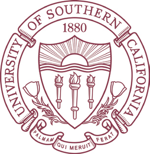

<h1 align="center">Applied Natural Language Processing CSCI544 20201<link rel="stylesheet" type="text/css" media="all" href="./css/logo.css"/></h1>
Offered by *Mark Core* from **University of Southern California, Los Angeles**
###### Course website: https://nld.ict.usc.edu/cs544-spring2020/
-----

Assignments for the 4.0 unit course taken at USC Department of Computer Science as part of my third Masters degree

### Course Summary
The goal of this course is to teach students fundamental and cutting-edge concepts in Natural Language Processing (NLP), and provide hands-on experience developing NLP applications in the form of programming assignments in Python. Students are expected to have programming experience and either be familiar with Python or able to quickly learn it during the first assignment.

Natural language is often ambiguous, and machine learning is crucial to making decisions under uncertainty. Many other tools in basic artificial intelligence (e.g., planning, knowledge representation and reasoning) also play a role in understanding and responding to natural language. However, this class is aimed at students with a general background in computer science (no need to take a machine learning or AI course as a prerequisite). Covers the necessary machine learning and basic AI material in this course.

The topics tentatively planned for this semester are listed below and include speech processing (language modeling, speech recognition, speech synthesis), linguistic foundations (parts of speech, syntax, speech disfluencies, semantics, dialogue, discourse), machine learning, and applications (information retrieval, information extraction, machine translation, natural language generation, dialogue systems, automated grading). There is no required text book for the course; lectures will be used to cover the material. References for optional reading materials will be provided for each lecture but there will be no required readings. One source of material for the course is **Jurafsky and Martin's** book *"Speech and Language Processing."* The second edition was published in 2009. While the third edition is being written, the draft chapters are available free and along with their class slides. Notable chapters include:

- Chapter 4: Naives Bayes Classification
- Chapter 19: Word Senses and WordNet
- Chapter 20: Semantic Role Labeling and Argument Structure
- Appendix A: Hidden Markov Models

Interested students can continue their study with other courses in USC's [computational linguistics curriculum](https://cl.usc.edu/courses/).

### Grading
####Programming assignments (60% in total).
Each assignment will have a specific rubric, but generally, the grades will depend on the performance of a system on unseen test data and a short technical report describing experiments on data provided (seen data). Each assignment will also have its own late policy, but generally there will be a penalty for each day late rapidly increasing to a zero grade on the assignment.

- **Assignment 1**: Due February 23rd, 4pm.
	- Total contribution towards final grade: 20%
	- Score: 100/100
- **Assignment 2**: Due April 13th, before midnight.
	- Total contribution towards final grade: 20%

-----
### Assignment 1: Spam filtering using a naïve Bayes classifier
##### Due Date: February 23rd, 4pm
###### Description: <a href="#"><i class="text-primary zoomlink fa fa-file-pdf-o fa-lg"></i><link href="https://stackpath.bootstrapcdn.com/font-awesome/4.7.0/css/font-awesome.min.css" rel="stylesheet" integrity="sha384-wvfXpqpZZVQGK6TAh5PVlGOfQNHSoD2xbE+QkPxCAFlNEevoEH3Sl0sibVcOQVnN" type="text/css" crossorigin="anonymous"/></a>